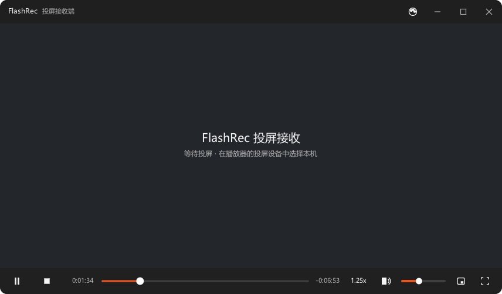

# FlashRec

[](https://github.com/jianglinbin/FlashRec/actions/workflows/release.yml)

DLNA / UPnP 投屏接收端（DMR）—— 把手机上的视频投到电脑屏幕上播放。

C++20 + 自绘 UI（nanovg / GLFW），Windows 与 Linux 一等公民。

## 界面预览

实际运行截图（默认皮肤「暗灰橙」，播放态：无边框 + 上下贴边栏 + 不操作自动隐去）：

<p align="center">
  
</p>

7 套内置皮肤只替换颜色与圆角 token，布局完全一致；把自定义皮肤 JSON 放进用户皮肤目录 `skins/`，托盘「重载皮肤」即可热加载。

## 下载

到 [Releases](https://github.com/jianglinbin/FlashRec/releases) 下载对应平台的安装包（每次发布四件齐全 + `SHA256SUMS.txt`）：

| 平台 | 文件 | 说明 |
|---|---|---|
| Windows | `FlashRec-<ver>-win64.zip` | 便携版，解压即用 |
| Windows | `FlashRec-<ver>-win64-setup.exe` | 安装版（Inno Setup，免管理员） |
| Debian / Ubuntu | `flashrec_<ver>_amd64.deb` | deb 包 |
| Linux 通用 | `FlashRec-<ver>-x86_64.AppImage` | 全捆绑，直接运行 |

## 特性

- **标准 DLNA DMR**：AVTransport / RenderingControl / ConnectionManager 三服务齐全，
  手机系统投屏、bilibili、腾讯视频等支持 DLNA 的 App 可直接发现并投屏。
- **多网卡正确**：「谁问就按谁回」—— M-SEARCH / SOAP / GENA 按对端所在网段回复，
  ALIVE / BYEBYE 每块网卡各发一份，URLBase 按请求 Host 头生成。多网卡机器不再出现
  「投屏成功但连不上」。
- **自绘 UI**：不依赖系统控件，各平台 / DPI 表现一致；常驻托盘，关窗即最小化到托盘
  （设备保持在线），真正退出走托盘菜单。
- **皮肤系统**：界面全部 token 化，由 JSON 皮肤驱动（`assets/skins.json`）；内置 7 套
  皮肤，`settings.json` 的 `ui.skin` 选择；用户皮肤目录放自定义 JSON，托盘「重载皮肤」
  热加载，改色无需重启。
- **播放**：libmpv 后端，硬解优先；老显卡 / 驱动的 GL 渲染链不可用时自动降级到软件渲染。
- **投屏呈现**：多屏可选、按屏记忆、自动全屏。
- **倍速播放**：控制栏 0.5x–3.0x 七档选择（点击弹出列表），记住上次档位。

## 构建

前置：CMake ≥ 3.24、Ninja、C++20 编译器（MSVC 2022 或 GCC 12+）。

```bash
# 1. 拉取第三方源码（pupnp / libmpv / nanovg / GLFW / spdlog）
bash tools/fetch_deps.sh

# 2. 配置并构建
cmake --preset win-msvc && cmake --build build     # Windows（MSVC + Ninja）
cmake --preset linux-gcc && cmake --build build    # Linux（GCC/Clang + Ninja）
```

平台注意事项：

- **Windows**：pupnp 依赖 pthreads4w，而 `fetch_deps.sh` **不管**它，需自行构建并
  安装到 `third_party/pthreads4w/install`（配置和打包脚本都按这个前缀找）。
  MSVC 工具链路径集中在 `tools/msvc_env.sh`（`source` 它可拿到 cmake / ninja / cl
  的绝对路径），按你的 VS 安装位置改一次即可。
- **Linux**：需 `cmake ninja-build`；要打 AppImage 还得有 `patchelf`。

默认构建为无控制台窗口（Windows GUI 子系统）；需要看日志时用 `flashrec --console`
启动，或配置 `-DFLASHREC_CONSOLE=ON` 构建一个带控制台的版本。控制台按 UTF-8 输出，
中文日志不再乱码。

## 打包

```bash
bash tools/package_windows.sh            # → dist/FlashRec-<ver>-win64.zip
                                         #   + FlashRec-<ver>-win64-setup.exe（Inno Setup）
bash tools/package_linux.sh              # → dist/flashrec_<ver>_amd64.deb
                                         #   + FlashRec-<ver>-x86_64.AppImage
```

两条脚本都支持 `--only`（`zip|exe` / `deb|appimage`）、`--skip-build`、`--clean`、`--smoke`。
Linux 那条**必须在 Linux 上跑**（依赖推导与 AppImage 工具都是 Linux 专属）。

也可以不本地打包：推送 `v*` tag 后由 [GitHub Actions](.github/workflows/release.yml)
自动构建双平台四件并挂到 Release（`workflow_dispatch` 可手动触发只出 artifact）。

## 用法

启动后程序常驻托盘。手机与电脑处于同一局域网，用任意支持 DLNA 的 App 投屏到
「FlashRec」即可。关闭窗口 = 最小化到托盘（设备仍在线）；退出请用托盘菜单。

换肤：编辑 `settings.json` 把 `ui.skin` 改成内置皮肤 id（`nord-snow` / `nord-frost` /
`nord-rose` / `nord-iris` / `nord-night` / `nord-forest` / `ubuntu-orange`），或在用户
皮肤目录放入自己的 JSON 后点托盘「重载皮肤」。

## 目录结构

| 目录 | 职责 |
|---|---|
| `src/app/` | 事件总线、配置、日志、生命周期 |
| `src/dmr/` | UPnP 设备与服务、SOAP 分发、GENA |
| `src/player/` | mpv 封装（全项目唯一 mpv API 出入口）、播放状态机 |
| `src/ui/` | nanovg 绘制、主题、视图与控件 |
| `src/platform/` | 窗口、托盘、防息屏、路径、网络接口枚举 |
| `cmake/` | 构建模块（依赖清单、平台开关、打包） |
| `assets/` | 随包资源：字体、图标、SCPD XML、默认配置、皮肤包 |
| `design/` | 皮肤设计真值（`skins.json` + 预览页） |
| `docs/` | README 配图（界面预览） |
| `tools/` | 构建 / 打包 / 自检脚本 |
| `tests/` | 协议验收与自检脚本 |

架构上的几条硬约束（对改动很关键）：`ui` / `dmr` / `player` 三者互不直接调用，只通过
事件总线通信；平台宏只准出现在 `src/platform/`；播放状态机的唯一真值在
`src/player/player_controller`；视觉 token 只写在 `Theme` 结构体，绘制代码零字面量色值。

## 说明

本仓库只包含源码与构建资产。开发过程记录（版本台账、规划文档）未随本仓库公开。

## 许可

MIT，见 [LICENSE](LICENSE)。

⚠️ 项目链接了 **libmpv**，其许可证为 LGPLv2.1+ / GPLv2+（取决于构建选项）。以本项目的
动态链接方式使用通常不受传染，但若要分发二进制，请先阅读
[THIRD_PARTY_NOTICES.md](THIRD_PARTY_NOTICES.md) 了解各依赖的许可条款。
